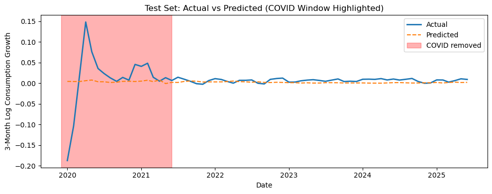

# Does a High Interest Rate Environment Suppress Consumption Growth?

## 1. Research Question

**Do macroeconomic conditions such as interest rates, inflation, and unemployment explain short-term changes in U.S. consumption?**

Instead of trying to build a highly accurate prediction model, the goal is to understand whether commonly used macro indicators contain meaningful information about short-term consumption growth.

---

## 2. Data

All data are monthly U.S. macroeconomic series obtained from FRED.

The following variables are used:

- **PCEC96**  
  Real Personal Consumption Expenditures  
  → Used to construct the target variable

- **FEDFUNDS**  
  Federal Funds Effective Rate  
  → Represents the interest rate environment

- **CPIAUCSL**  
  Headline Consumer Price Index  
  → Overall inflation

- **CPILFESL**  
  Core CPI (excluding food and energy)  
  → Persistent inflation component

- **UNRATE**  
  Unemployment Rate  
  → Labor market conditions

- **DSPIC96**  
  Real Disposable Personal Income  
  → Household income after taxes

The sample starts in 2007 and extends to 2025, depending on data availability after lag construction.

---

## 3. Target Variable

The target variable is defined as the **3-month log growth rate of real consumption**:

\[
y_t = \log(PCE_t) - \log(PCE_{t-3})
\]

This definition is used because:
- Monthly consumption data is noisy
- A 3-month window smooths short-term fluctuations
- Policy and labor market effects often take time to appear

Because this is a rolling growth measure, large shocks affect multiple adjacent observations.

---

## 4. Methodology

A Ridge regression model is used.

The model includes:
- Lagged macroeconomic variables
- Standardization using `StandardScaler`
- L2 regularization to handle multicollinearity

This model is chosen for its simplicity and interpretability.  
The purpose is to examine relationships, not to build a black-box forecasting system.

---

## 5. Evaluation Strategy

The data is split by time:

- **Training set:** data before 2020  
- **Test set:** data from 2020 onward

Model performance is evaluated in two ways:

1. **Including the COVID-19 period**  
   → reflects real-world performance

2. **Excluding the COVID-19 period**  
   → December 2019 to June 2021 is removed  
   → adjusted to match the 3-month growth definition

This separation helps distinguish normal economic behavior from crisis-driven shocks.

---

## 6. Results

| Evaluation Setting | RMSE  | R²      |
|--------------------|-------|---------|
| With COVID-19      | 0.0353| -0.0124 |
| Excluding COVID-19 | 0.0066| -1.6999 |

- When the COVID-19 period is included, prediction errors increase significantly.
- After excluding COVID-19, the RMSE decreases, meaning better average accuracy.
- However, R² becomes unstable or strongly negative because consumption growth varies very little during normal periods.

This suggests that macro variables explain average consumption behavior, but not short-term fluctuations.

---

## 7. Visualization

A comparison of actual and predicted consumption growth shows that:
- Predictions remain smooth during normal periods
- The model fails to capture extreme drops and rebounds during COVID-19

This highlights the exogenous nature of the pandemic shock.

---

## 8. Limitations

- The model cannot predict sudden policy or behavioral shocks.
- Short-term consumption growth has very low variance in normal times.
- Only aggregate macro variables are used; household-level behavior is not considered.

These limitations reflect the scope of the analysis rather than modeling errors.

---

## 9. Conclusion

Macroeconomic variables influence the overall level of consumption,  
but short-term consumption growth is difficult to explain outside of crisis periods.

This project shows both the usefulness and the limits of macro-based regression models.
